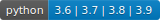

# combu

[](https://circleci.com/gh/takelushi/combu)  [](https://opensource.org/licenses/MIT) 

Execute your method with combination parameters.

## Use cases

* Testing
   * Test pattern.
* Machine learning
   * Model validation.
   * Grid search.
* Web Scraping
   * Query parameters pattern.

## Install

```sh
pip install conbu
```

## Usage

### One time loop

```python
import combu

def func(v1, v2):
   return v1 + v2


params = {'v1': ['a', 'b'], 'v2': ['A', 'B']}
for res, param in combu.execute(func, params):
   print(res, param)

# Output
'''
aA {'v1': 'a', 'v2': 'A'}
aB {'v1': 'a', 'v2': 'B'}
bA {'v1': 'b', 'v2': 'A'}
bB {'v1': 'b', 'v2': 'B'}
'''

# Set loop order
order = ['v2', 'v1']
for res, param in combu.execute(func, params, order=order):
   print(res, param)

# Output
'''
aA {'v2': 'A', 'v1': 'a'}
bA {'v2': 'A', 'v1': 'b'}
aB {'v2': 'B', 'v1': 'a'}
bB {'v2': 'B', 'v1': 'b'}
'''
```

### Reloopable by using class

```python
import combu

def func(v1, v2):
   return v1 + v2

comb = combu.Combu(func)
# You can set order on initializer.
# comb = combu.Combu(func, order=['v2', 'v1'])

params = {'v1': ['a', 'b'], 'v2': ['A', 'B']}
for res, param in comb.execute(params):
   print(res, param)

params = {'v1': ['x', 'y'], 'v2': ['X', 'Y']}
for res, param in comb.execute(params):
   print(res, param)

# You can set order on Combu.execute().
for res, param in comb.execute(params, order=['v2', 'v1']):
   print(res, param)
```

### Hooks

* Hooks flow

   ```txt
   order = [A, B]

   before_a()
   for a in A:
      before_b()
      before_each_a()
      for b in B:
         before_each_b()
         func()
         after_each_b()
      after_each_a()
      after_b()
   after_a()
   ```

* Define hooks.

   ```python
   def func(v1, v2):
      pass

   def before_v1(v1, v2):
      pass

   # Initialize with hooks.
   # Available:
   # * before
   # * after
   # * before_each
   # * after_each
   comb = Comb(func, before={'v1': before_v1})

   # Set a hook after initialized.
   # Available:
   # * set_before(k, func)
   # * set_after(k, func)
   # * set_before_each(k, func)
   # * set_after_each(k, func)
   comb.set_before('v1', before_v1)
   ```

### Utility

* Create parameter combination (not execute any functions).
   * `combu.create_values`
* Count combinations.
   * `combu.util.count`
* Shuffle parameters.
   * `combu.util.shuffle_params`

## Examples

* Available on `./examples`.

## Development

* Requirements: poetry, pyenv

```sh
# Setup
poetry install

# Lint & Test
mkdir report
poetry run flake8 --format=html --htmldir=report/flake-report src/ tests/
poetry run pytest --cov-report term-missing --cov=combu tests/
poetry run pytest --cov-report html:report/coverage --cov=combu tests/

# Build and publish
poetry run python create_badges.py
poetry build
poetry publish
```
